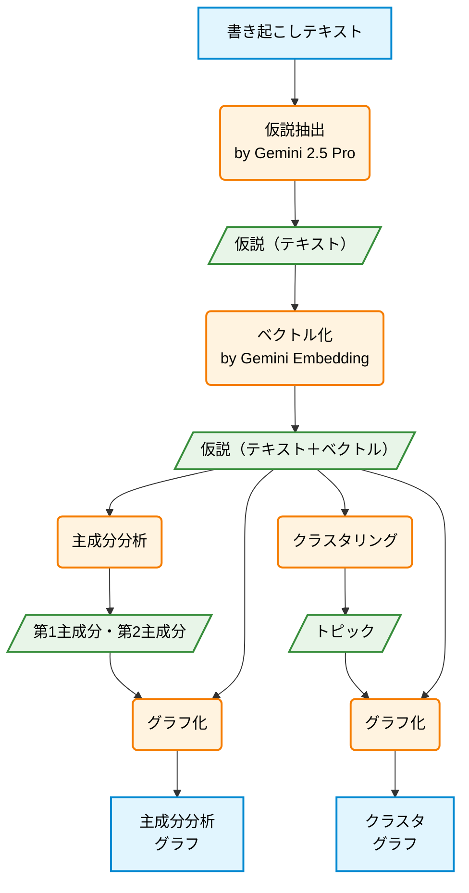

# Embedding可視化ツール

このプロジェクトは、次元削減とクラスタリング技術を用いてテキスト埋め込み（embedding）を可視化するPythonスクリプトを提供します。入力JSONに埋め込みが含まれていない場合は、Google Gemini APIを利用して生成します。

## 機能

*   Gemini APIを使用してテキストデータの埋め込みを生成します。
*   `.txt`ファイル（1行に1テキスト）または`.json`ファイル（テキスト、オプションの埋め込み、ラベル、詳細フィールドを持つオブジェクトのリスト）からの入力をサポートします。
*   高次元の埋め込みを以下の手法で2次元に可視化します:
    *   PCA (主成分分析)
    *   UMAP (Uniform Manifold Approximation and Projection) とBERTopicを組み合わせたクラスタリング
*   Plotly Expressを使用してインタラクティブなHTMLプロットを作成し、ホバー時にテキスト、詳細、ラベル/トピックを表示します。



## スクリプト

### 1. `embedding_pca_plot.py`

*   **目的:** テキスト埋め込みに対してPCAを実行し、2D散布図を生成します。
*   **入力:** `.txt`ファイルまたは`.json`ファイル。
    *   **JSONフィールド:**
        *   `text` (必須): テキストの内容。
        *   `embedding` (任意): 事前計算された埋め込みベクトル。存在しないか無効な場合は生成されます。
        *   `label` (任意): データポイントのラベル（デフォルトは "unknown"）。
        *   `details` (任意): ホバー時に表示する補足情報。
*   **出力:** `<input_filename_stem>_pca.html` という名前のインタラクティブなHTMLファイル。点は元のラベル（`.txt`ファイルの場合はデフォルトラベル）によって色分けされます。
*   **使用法:**
    ```bash
    pipenv run python embedding_pca_plot.py -i path/to/your/input.json [options]
    # または
    pipenv run python embedding_pca_plot.py -i path/to/your/input.txt [options]
    ```
*   **オプション:** JSONフィールド名や出力パスのカスタマイズについては `pipenv run python embedding_pca_plot.py --help` を参照してください。

### 2. `embedding_clustering_plot.py`

*   **目的:** テキスト埋め込みに対してBERTopic（内部でUMAPとHDBSCANを利用）を用いたトピックモデリングを実行し、次元削減のためにUMAPを使用して結果を可視化します。
*   **入力:** `.txt`ファイルまたは`.json`ファイル（`embedding_pca_plot.py`と同じ形式）。
*   **出力:** `<input_filename_stem>_umap_hdbscan.html` という名前のインタラクティブなHTMLファイル。点はBERTopicによって割り当てられたトピックIDによって色分けされます。外れ値は特定のラベルの下にグループ化されます。ホバー情報には、元のテキスト、詳細、元のラベル、BERTopicトピックが含まれます。
*   **使用法:**
    ```bash
    pipenv run python embedding_clustering_plot.py -i path/to/your/input.json [options]
    # または
    pipenv run python embedding_clustering_plot.py -i path/to/your/input.txt [options]
    ```
*   **オプション:** 詳細については `pipenv run python embedding_clustering_plot.py --help` を参照してください。

## セットアップ

1.  **リポジトリをクローンします（まだの場合）。**
2.  **Pipenvを使用して依存関係をインストールします:**
    ```bash
    pipenv install
    ```
3.  **Gemini APIキーを設定します:**
    これらのスクリプトにはGoogle Gemini APIキーが必要です。環境変数として設定してください:
    ```bash
    export GEMINI_API_KEY='YOUR_API_KEY'
    ```
    `YOUR_API_KEY` を実際のキーに置き換えてください。

## スクリプトの実行

プロジェクトディレクトリにいること、およびpipenv環境をアクティベートしていること（`pipenv shell`）を確認するか、各コマンドの前に `pipenv run` を使用してください。

**例 (PCA):**
```bash
pipenv run python embedding_pca_plot.py -i sample.json -o sample_pca_output.html
```

```bash
pipenv run python embedding_pca_plot.py -i abduction_embeddings.json --json-embedding-field hypothesis_embedding --json-text-field hypothesis --json-details-field fact_episode --json-label-field series
```

**例 (クラスタリング):**
```bash
pipenv run python embedding_clustering_plot.py -i abduction_embeddings.json
```

テキストやフィールドを指定する場合
```bash
pipenv run python embedding_clustering_plot.py -i abduction_embeddings.json --json-embedding-field hypothesis_embedding --json-text-field hypothesis --json-details-field fact_episode --json-label-field series
```